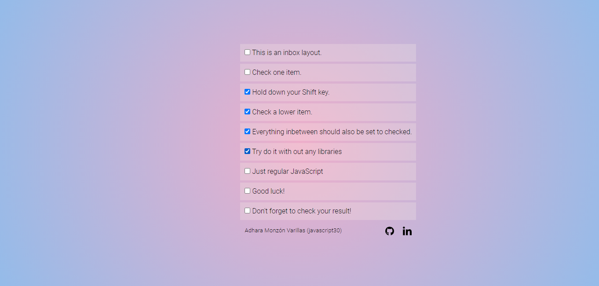

# reto-10-js-multiple-checkboxes

## Para empezar a usarlo

Desde la web: https://adharamonzon.github.io/reto-10-js-multiple-checkboxes/ te saldrá el navegador como un lienzo en blanco, listo para que empieces a colorear!.

## Para instalar el poryecto

Puedes clonarte el repositorio a través de este enlace, poniendo en la consola **git clone** https://github.com/adharamonzon/reto-10-js-multiple-checkboxes.git y abrir el servidor.

## El reto 🚀

este es el decimo reto de JavaScript, cuyo **objetivo** es utilizar inputs de tipo **checkbox** en el que manteniendo pulsada la tecla _shift_ se seleccionen todas las tareas entre medias a la vez.

# Resultado

💥 Este es el resultado! 💥

https://github.com/adharamonzon/reto-10-js-multiple-checkboxes
